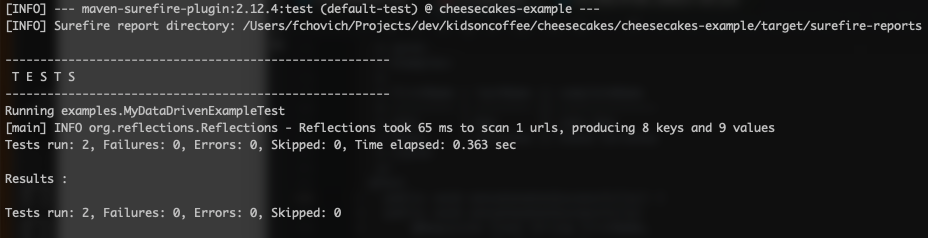

<h1 align="center">
  <br>
  
  <br>
  Cheesecakes
  <br>
</h1>

<h4 align="center">A data-driven testing framework built on top of <a href="https://junit.org/junit4/" target="_blank">Junit</a>.</h4>

<p align="center">
  <a href="https://oss.sonatype.org/#nexus-search;quick~kidsoncoffee">
    
  </a>
  <a href="https://circleci.com/gh/kidsoncoffee/workflows/cheesecakes">
      
  </a>
  <a href="https://www.codacy.com/app/fernandochovich/cheesecakes?utm_source=github.com&amp;utm_medium=referral&amp;utm_content=kidsoncoffee/cheesecakes&amp;utm_campaign=Badge_Grade">
      
  </a>
  <a href="https://github.com/kidsoncoffee/cheesecakes/issues">
      
  </a>
  <a href="https://opensource.org/licenses/MIT">
      
  </a>
  <br/>
  <a href="#">
      
  </a>
  <a href="https://gitter.im/cheesecakes-ddt">
    
  </a>
  <a href="https://saythanks.io/to/kidsoncoffee">
      
  </a>
</p>

<p align="center">
  <a href="#key-features">Key features</a> •
  <a href="#quickstart">Quickstart</a> •
  <a href="#deep-dive">Deep dive</a> •
  <a href="#download">Download</a> •
  <a href="#related">Related</a> 
</p>

## Key Features

* Write test scenarios using *data-driven* tables, with the test method **Javadoc** as the single source of information
* Injects requisites and expectations directly into the test method parameters
* Use auto-generated builders to write scenarios programmatically

## Quickstart

The following steps goes through all aspects of creating *data-driven* scenarios using **Cheesecakes**. 

All throughout the instructions are links to more advanced features or in-depth explanation of a particular concept. 

We assume that **you are already familiar with Junit** (if that's not the case give [this](https://junit.org/junit4/) a reading) but if you never used **Junit parameterized tests**, it is recommended that you follow this quickstart and then go back and customize to fit your needs.

### Import the dependency

#### Maven

```diff
<dependencies>

+    <dependency>
+      <groupId>com.github.kidsoncoffee</groupId>
+      <artifactId>cheesecakes</artifactId>
+      <version>...</version>
+      <scope>test</scope>
+    </dependency>

</dependencies>
```

#### Gradle

```diff
dependencies {

+  testImplementation 'com.github.kidsoncoffee:cheesecakes:...'

}
```

### Add the custom runner to your Junit test class

```diff
package examples;

+ import com.kidsoncoffee.cheesecakes.runner.Cheesecakes;
import org.junit.Test;
+ import org.junit.runner.RunWith;

+ @RunWith(Cheesecakes.class)
public class MyDataDrivenExampleTest {

  /**
   * Checks that the first and last name are concatenated correctly.
   */
  @Test
  public void concatenatesSuccessfully() {

  }
}
```

### Write the test's scenario examples

```diff
package examples;

import com.kidsoncoffee.cheesecakes.runner.Cheesecakes;
import org.junit.Test;
import org.junit.runner.RunWith;

@RunWith(Cheesecakes.class)
public class MyDataDrivenExampleTest {

  /**
   * Checks that the first and last name are concatenated correctly.
+   *
+   * <pre>
+   * Examples:
+   *
+   * firstName | lastName | completeName
+   * --------- | -------- | --------------
+   * John      | Doe      | John Doe
+   * Exene     | Cervenka | Exene Cervenka
+   * </pre>
   */
  @Test
  public void concatenatesSuccessfully() {

  }
}
```

This step can be done after writing the test logic as well.

### Write the test case logic

```diff
package examples;

+ import com.kidsoncoffee.cheesecakes.Parameter.Expectation;
+ import com.kidsoncoffee.cheesecakes.Parameter.Requisite;
import com.kidsoncoffee.cheesecakes.runner.Cheesecakes;
import org.junit.Test;
import org.junit.runner.RunWith;

@RunWith(Cheesecakes.class)
public class MyDataDrivenExampleTest {

  /**
   * Checks that the first and last name are concatenated correctly.
   *
   * <pre>
   * Examples:
   *
   * firstName | lastName | completeName
   * --------- | -------- | --------------
   * John      | Doe      | John Doe
   * Exene     | Cervenka | Exene Cervenka
   * </pre>
   */
  @Test
-   public void concatenatesSuccessfully() {
+   public void concatenatesSuccessfully(
+       @Requisite final String firstName,
+       @Requisite final String lastName,
+       @Expectation final String completeName) {
+     final String actualCompleteName;
+
+     when:
+     actualCompleteName = String.format("%s %s", firstName, lastName);

+     then:
+     assert actualCompleteName.equals(completeName);
  }
}

```

### Run the tests

Now you should be able to run this test successfully and see that each **scenario example** runs independently.


<br/>


* [How to run tests in Intellij](https://www.jetbrains.com/help/idea/performing-tests.html)
* [How to run tests in Maven](http://maven.apache.org/surefire/maven-surefire-plugin/examples/single-test.html)

## Deep Dive

### Concepts

In general, *Cheesecakes* concepts tries to be close to *[Gherkin](https://cucumber.io/docs/gherkin/reference/)* concepts, but as it needs to translate to *Java* code as well, some simplification needed to happen.

#### Feature or Feature test class

In *Gherkin*: 
> The purpose of the Feature keyword is to provide a high-level description of a software feature, and to group related scenarios.

In *Cheesecakes*, **a *Feature* is a test class that groups related scenarios.**

For example, a class named *Aggregator*, being the unit under test, has an accompanying class named *AggregatorTest*, which contains all test cases related to that unit. This *AggregatorTest* class is the *Feature test class*.

#### Scenario or Scenario method

In *Gherkin*:

> This is a concrete example that illustrates a business rule. It consists of a list of steps.
> The keyword Scenario is a synonym of the keyword Example.

In *Cheesecakes*, **a *Scenario* is a test method that describe an expected behavior of the unit under test**. It also consists of a list of steps. 

A *Scenario* may be parameterized to indicate requisites and expectation values that are important for the execution of that test case. 

A *Scenario* may be executed more than once but with different input values.

#### Example

In *Gherkin*, a *Scenario* and an *Example* are synonyms but they also have a keyword to describe something more close to an *Example* in *Cheesecakes*. This is how a *Scenario Outline* is described:

> The Scenario Outline keyword can be used to run the same Scenario multiple times, with different combinations of values.

In *Cheesecakes*, **an *Example* is the definition of requisites and expectations values of a *Scenario***.

There are a couple of different ways to create *Examples* for a given *Scenario*:
* Programmatically with a builder-like syntax
* Through a data-driven table in the *Scenario* method *Javadoc*.

### Creating an *Example* for a *Scenario*

#### Data tables

As shown in the *Quickstart*, data tables are probably the most effective way for writing and reading test cases that have similar behavior for different requisites and expectations.

```java
/**
 * <pre>                                                   // Pre-formatted text prevents the IDE from formatting
 * Examples:                                               // Mandatory line with the keyword Examples:
 *                                                         // Empty lines are ignored
 * requisiteA | requisiteB | expectationA | expectationB   // The data table header row
 * ---------- | ---------- | ------------ | ------------   // The data table separator row
 * 1          | 2          | A            | B              // The first example
 * 3          | 4          | X            | Y              // The second example
 * </pre>
 */                                                         
```

The example are written on the *Scenario* method *Javadoc*, but needs to follow these guidelines:
* The data table should be the last thing in the *Javadoc* (beside closing `<pre>`, `@param`, `@return` and other usual tags).
* Just before the data table the keyword `Examples:` should be present (empty lines are ignored).
* The data table should contain a *header row*, a *separator row* and at least one *example row*.
* The data table columns should be separated by:
  * A single pipe symbol (`|`) for all values, except for the case below.
* The data table should have the same number of columns

Optionally but recommended, wrap all above in `<pre>` tags, so you can control formatting.

#### Programmatically

##### One *Example* by field

During the annotation processing phase in the build, some classes are auto generated based on the *Scenario* method signature. This gives a lot of flexibility to the developer and can be very powerful when generating requisites and expectations values dynamically.

For example, for the *Feature* class in the *Quickstart*, the same *Examples* could be written like this:

```java
package examples;

import com.kidsoncoffee.cheesecakes.Example;
import com.kidsoncoffee.cheesecakes.Parameter.Expectation;
import com.kidsoncoffee.cheesecakes.Parameter.Requisite;
import com.kidsoncoffee.cheesecakes.runner.Cheesecakes;
import examples.MyProgrammaticallyExampleTest_ExampleBuilder.ConcatenatesSuccessfully;
import org.junit.Test;
import org.junit.runner.RunWith;

@RunWith(Cheesecakes.class)
public class MyProgrammaticallyExampleTest {

  private static Example.Builder JOHN_DOE_EXAMPLE =
      ConcatenatesSuccessfully.given()
          .firstName("John")
          .lastName("Doe")
          .then()
          .completeName("John Doe")
          .getExample();

  private static Example.Builder EXENE_CERVENKA_EXAMPLE =
      ConcatenatesSuccessfully.given()
          .firstName("Exene")
          .lastName("Cervenka")
          .then()
          .completeName("Exene Cervenka")
          .getExample();

  @Test
  public void concatenatesSuccessfully(
      @Requisite final String firstName,
      @Requisite final String lastName,
      @Expectation final String completeName) {
    final String actualCompleteName;

    when:
    actualCompleteName = String.format("%s %s", firstName, lastName);

    then:
    assert actualCompleteName.equals(completeName);
  }
}
```

An auto-generated *Example* class can be instantiated following the pattern: `<NAME_OF_THE_FEATURE_CLASS>_ExampleBuilder.<NAME_OF_THE_SCENARIO_METHOD>.given()`. For example, looking at the example above, for the *Feature* class **MyTest** and *Scenario* method **test**, an *Example* class is instantiated with **MyProgrammaticallyExampleTest_ExampleBuilder.ConcatenatesSuccessfully.given()**. Note that the *Scenario* method equivalent in the *Example* class is in *Pascal Case*.

It is required that the *Example* field in the *Feature* class is declared as **static**.

##### Multiple *Examples* by field

```java
package examples;

import com.kidsoncoffee.cheesecakes.Example;
import com.kidsoncoffee.cheesecakes.Parameter;
import com.kidsoncoffee.cheesecakes.runner.Cheesecakes;
import examples.MyProgrammaticallyMultipleExamplesTest_ExampleBuilder.ConcatenatesSuccessfully;
import org.junit.Test;
import org.junit.runner.RunWith;

import static com.kidsoncoffee.cheesecakes.Example.multiple;

@RunWith(Cheesecakes.class)
public class MyProgrammaticallyMultipleExamplesTest {

  private static Example.Multiple SUCCESS_EXAMPLES =
      multiple(
          ConcatenatesSuccessfully.given()
              .firstName("John")
              .lastName("Doe")
              .then()
              .completeName("John Doe")
              .getExample(),
          ConcatenatesSuccessfully.given()
              .firstName("Exene")
              .lastName("Cervenka")
              .then()
              .completeName("Exene Cervenka")
              .getExample());

  @Test
  public void concatenatesSuccessfully(
      @Parameter.Requisite final String firstName,
      @Parameter.Requisite final String lastName,
      @Parameter.Expectation final String completeName) {
    final String actualCompleteName;

    when:
    actualCompleteName = String.format("%s %s", firstName, lastName);

    then:
    assert actualCompleteName.equals(completeName);
  }
}

```

You can also use the `Example.multiple` aggregator to have only one *Example* static field declared. Even though that may turn into identation hell in some cases, it might help legibility in others.

This can be used to generate test cases dynamically as well.

### Parameters injection

If you are writing your examples with the *builder-like* syntax you are already writing code to match the types of the parameters in the *Scenario* method. But if you are writing them with data tables, you will need to convert that *String* value into the appropriate type of the *Scenario* method parameters.

#### Common Java types

For the most common types, **Cheesecakes** provides conversion out-of-the-box.

* `short` and `Short`
* `byte` and `Byte`
* `int`and `Integer`
* `long`and `Long`
* `float` and `Float`
* `double` and `Double`
* `boolean` and `Boolean`
* `char` and `String`
* `Class`
* `enum`

#### Custom types

To register custom type converter is easy:

```java
package examples;

import com.kidsoncoffee.cheesecakes.Parameter;
import com.kidsoncoffee.cheesecakes.Parameter.Conversion;
import com.kidsoncoffee.cheesecakes.Parameter.Expectation;
import com.kidsoncoffee.cheesecakes.Parameter.Requisite;
import com.kidsoncoffee.cheesecakes.runner.Cheesecakes;
import org.apache.commons.lang3.text.WordUtils;
import org.junit.Test;
import org.junit.runner.RunWith;

import java.util.function.Function;

@RunWith(Cheesecakes.class)
public class MyCustomConverterExampleTest {

  /**
   * Checks that the first and last name are concatenated correctly.
   *
   * <pre>
   * Examples:
   *
   * firstName | lastName | completeName
   * --------- | -------- | --------------
   * JOHN      | DOE      | John Doe
   * </pre>
   */
  @Test
  public void concatenatesSuccessfully(
      @Requisite @Conversion(PascalCaseConverter.class) final String firstName,
      @Requisite @Conversion(PascalCaseConverter.class) final String lastName,
      @Expectation final String completeName) {
    final String actualCompleteName;

    when:
    actualCompleteName = String.format("%s %s", firstName, lastName);

    then:
    assert actualCompleteName.equals(completeName);
  }

  private class PascalCaseConverter extends Parameter.Converter<String> {

    @Override
    public Class<String> getTargetType() {
      return String.class;
    }

    @Override
    public Function<Parameter.Convertible, String> getConverter() {
      return raw -> WordUtils.capitalize(raw.getValue().toLowerCase());
    }
  }
}
```

Looking at the example above, for a parameter to be specifically converted, is required:
* The custom converter to implement `Parameter.Converter`
* The parameter to be converted to be annotated with `@Parameter.Conversion` and the class of the custom converter to be passed as the value to the converter.

## Download

Check it out @ [Nexus](https://oss.sonatype.org/service/local/repositories/releases/content/com/github/kidsoncoffee/cheesecakes/1.0.0/cheesecakes-1.0.0.jar).

## Related

* [Data driven testing @ wikipedia](https://en.wikipedia.org/wiki/Data-driven_testing)
